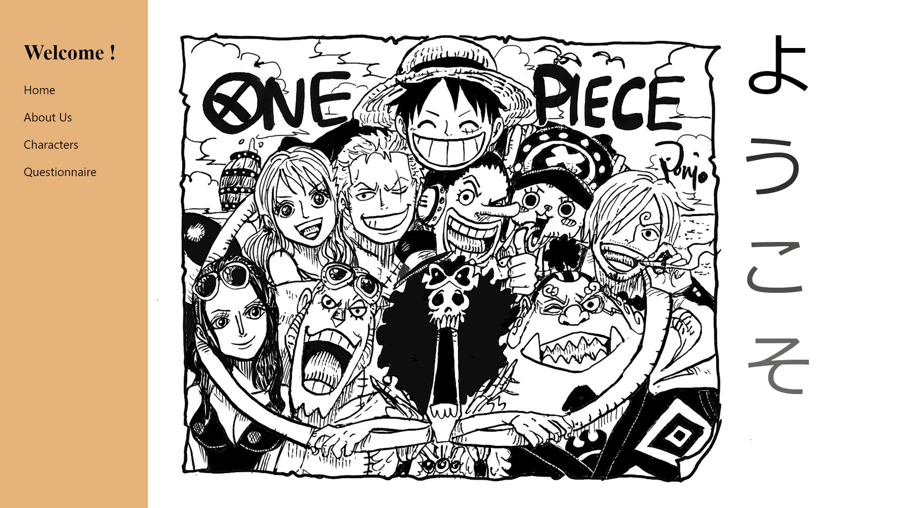
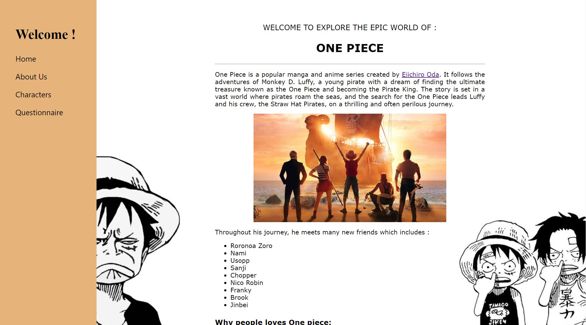
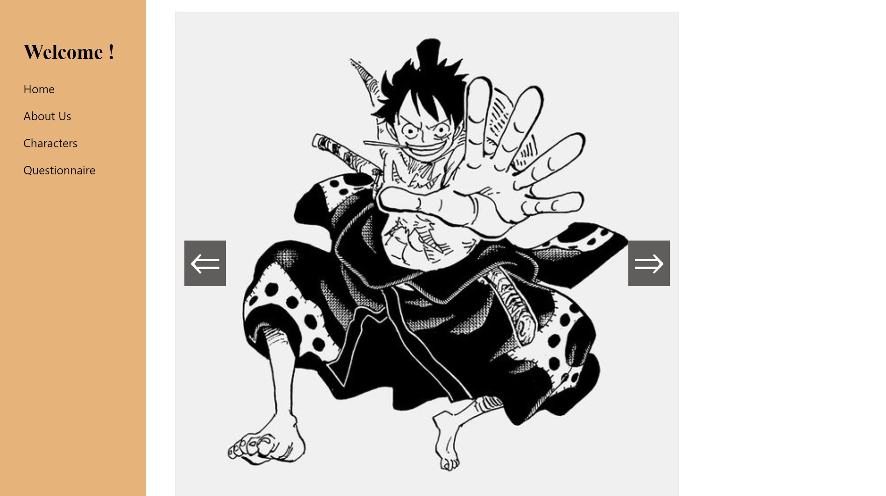
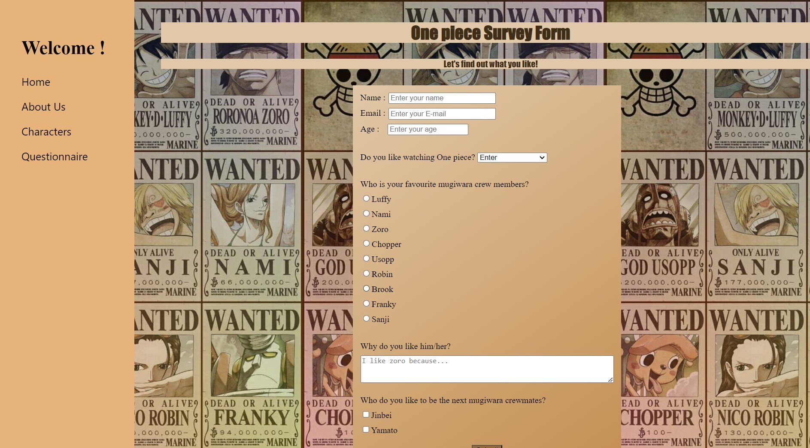

# I did it 80% by myself. I combined all the things I have learned in this class to this project and I add a little bit of things here and there. The questionnaire was done by me alone, the changing of sites was also done by tweaking here and there alone. the characters slide where you can go to the left and right was learned by watching youtube and a little bit of this was done by using chat gpt. Here are the link of youtube I used

- https://www.youtube.com/watch?v=JwS6CIicHAg&t=686s&ab_channel=CodingKnowledge
- https://www.youtube.com/watch?v=hYodWWpDTMU&ab_channel=Codegitate
- https://www.youtube.com/watch?v=SgmNxE9lWcY&t=905s&ab_channel=SlayingTheDragon

There are 4 parts in my project:
-Home 

-About us 

-Characters

-questionnaire

Thankyou!
